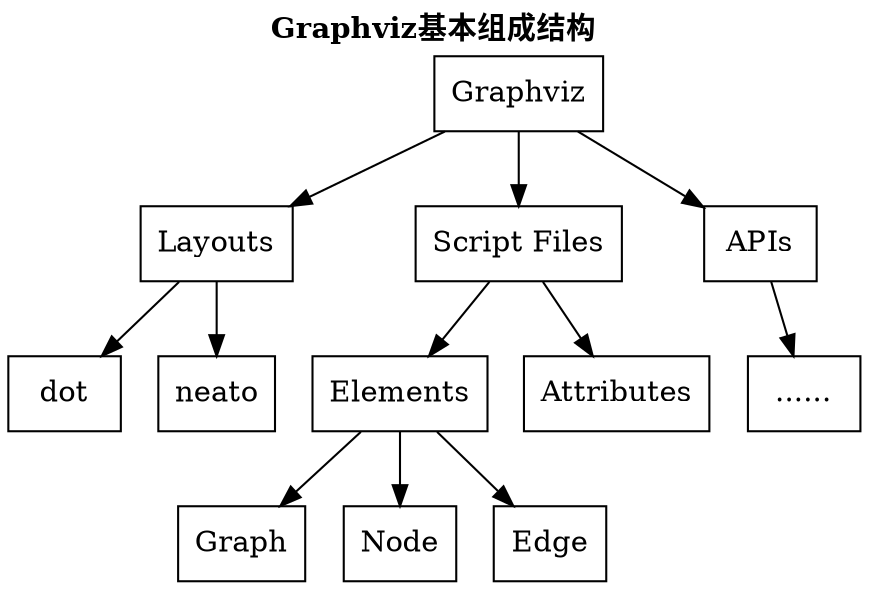

## 0%: 从0开始的Hexo流程图探险

## 15%: Graphviz?Dot?这都是什么🧎‍♀️?

First Term
: This is the definition of the first term.

Second Term
: This is one definition of the second term.
: This is another definition of the second term.